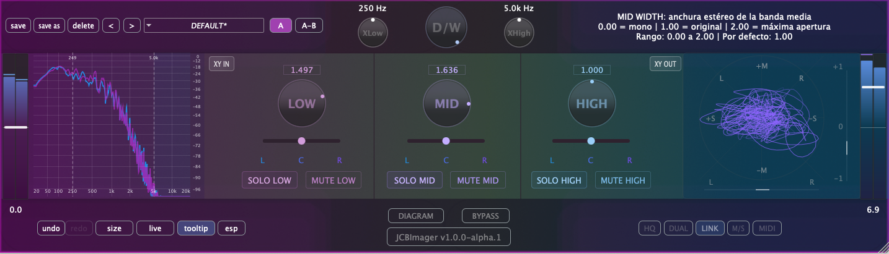

Procesador de imagen estéreo multibanda desarrollado en gen~, exportado con [gen~ Plugin Export](https://github.com/Cycling74/gen-plugin-export) y finalizado con [JUCE](https://github.com/juce-framework/JUCE). Forma parte de un conjunto de herramientas didácticas que utilizo en la asignatura de Técnicas de Grabación y Masterización para Música Electroacústica del [MCE](https://katarinagurska.com/curso-of/master-de-composicion-electroacustica-mce/). Originalmente creado con JUCE 6 hace unos años, el proyecto ha evolucionado significativamente en su interfaz gráfica y funcionalidad gracias al desarrollo con Claude Code y posteriormente con Codex CLI. Para más detalles técnicos, consulta [NOTAS.md](NOTAS.md).

El proyecto ha evolucionado en interfaz y UX durante 2025. Para más detalles técnicos, consulta [NOTAS.md](NOTAS.md).

## Instalación macOS
1. Descarga el archivo DMG desde la página de [Releases](https://github.com/cjitter/JCBImager/releases)
2. Abre el DMG y ejecuta el instalador
3. El instalador colocará automáticamente los tipos de plugins seleccionados en las ubicaciones correctas del sistema:
   - VST3: `/Library/Audio/Plug-Ins/VST3/`
   - AU: `/Library/Audio/Plug-Ins/Components/`
   - AAX: `/Library/Application Support/Avid/Audio/Plug-Ins/`

*Nota: El DMG está firmado y notarizado para macOS.*

## Requisitos del sistema

- macOS 10.12 o posterior
- Procesador Intel o Apple Silicon
- DAW compatible con VST3, AU o AAX
- Probado en: Pro Tools, Reaper, Logic, Ableton Live y Bitwig

## Compilación desde código fuente

### Requisitos previos
- Git, [CMake](https://cmake.org) 3.20 o posterior, compilador Apple Clang compatible con C++20 (incluido en Xcode 13 o superior).
- [JUCE](https://github.com/juce-framework/JUCE) 8.0.8 (se descarga automáticamente via FetchContent)
- **AAX SDK**, solo requerido para compilar formato AAX - disponible desde cuenta de desarrollador Avid, etc.

### Instrucciones de compilación

1. Clona el repositorio:
```bash
git clone https://github.com/cjitter/JCBImager.git
cd JCBImager
```

2. **Configuración del proyecto**:
```bash
# Configurar proyecto Debug (VST3 y AU)
cmake -B build-debug -DCMAKE_BUILD_TYPE=Debug

# Configurar proyecto Release (VST3 y AU)
cmake -B build-release -DCMAKE_BUILD_TYPE=Release

# Configurar proyecto Debug/Release con AAX (requiere AAX SDK y Pro Tools Developer instalado)
cmake -B build-debug -DCMAKE_BUILD_TYPE=Debug -DJUCE_BUILD_AAX=ON
```

**Nota sobre generadores**: Por defecto, CMake usa Unix Makefiles en macOS. También puedes especificar otros generadores:
- **Ninja** (más rápido): `cmake -B build -G Ninja`
- **Xcode** (IDE nativo): `cmake -B build -G Xcode`

**Nota sobre AAX**: Si configuras con la opción AAX habilitada, cuando compiles el plugin se instalará automáticamente en `/Applications/Pro Tools Developer/Plug-Ins/` para testing con Pro Tools Developer.

3. **Compilación**:
```bash
# Compilar el proyecto configurado
cmake --build build-debug    # Para Debug
cmake --build build-release   # Para Release
```

## Características principales (v1.0.0-alpha.1)

- Procesador de imagen estéreo multibanda: procesa independientemente 3 bandas de frecuencia utilizando filtros LR4.
- Matriz MS con compensación ajustada aplicada a cada banda.
- Controles de Solo, Mute y Balance por banda para monitoreo y ajuste preciso.
- Controles principales: manipulación del campo estéreo por banda con control de anchura y posición.
- Analizador visual: goniometer con medidores de correlación y balance LR, además del espectro por banda.
- Conmutación XY/MS en entrada y salida con compensación automática y visualización coherente.

## Recursos

### Bibliografía técnica
- [Graham Wakefield & Gregory Taylor - *Generating Sound and Organizing Time*](https://cycling74.com/books/go)
- [Matthijs Hollemans - *The Complete Beginner's Guide to Audio Plug-in Development*](https://www.theaudioprogrammer.com/books/beginners-plugin-book)

## Testing con pluginval

Este proyecto incluye tests automáticos con [pluginval](https://github.com/Tracktion/pluginval) para validar el plugin.

### Configuración

- **Detección automática**: Si tienes pluginval instalado, CMake lo detectará automáticamente
- **Descarga automática**: Si no está instalado, se descargará automáticamente en la carpeta `tools/`
- Para desactivar la descarga automática:
  ```bash
  cmake -B build -DPLUGINVAL_AUTO_DOWNLOAD=OFF
  ```

### Ejecutar los tests

```bash
# Entra al directorio de build (el mismo nombre que usaste después de -B al configurar)
# Por ejemplo: si usaste "cmake -B build", entonces:
cd build

# Ejecutar todos los tests de pluginval con salida detallada
# Usa -C Release o -C Debug según cómo compilaste el plugin
# Nota: Los tests completos pueden tardar varios minutos
ctest -C Release -R pluginval -V
```

Los tests validan los formatos VST3 y AU del plugin.

## Por hacer

- Añadir presets de fábrica para configuraciones típicas de imagen estéreo.
- Crear versión simplificada para Max for Live.
- Portar el modelo a SuperCollider como UGen personalizado.

---

*© 2025 Juan Carlos Blancas – JCBImager v1.0.0-alpha.1*
